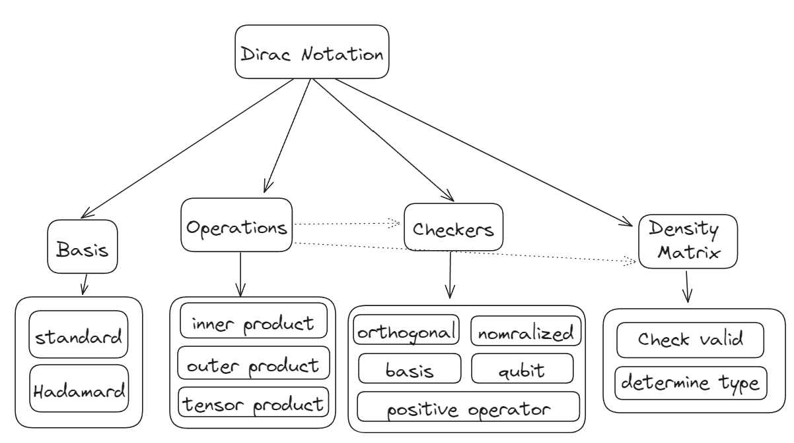
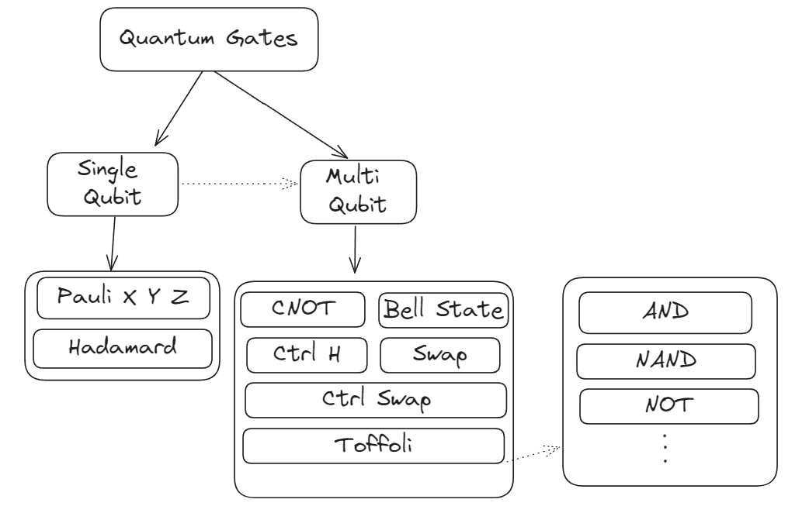

<div align = "center">

<h1> QuanTorch </h1>


</div>

**QuanTorch** is an educational library based on [Pytorch](https://pytorch.org/) to build quantum systems, the library is designed to be simple, self-contained and easy to use.

# Current Features:
- Dirac Notation
    - Basis Vectors & States
    - Basic Operations
    - Checkers
    - Density Matrix
    - Finding Probabilities
- Quantum Gates
    - Single Qubit Gates
    - Multi Qubit Gates
    - [ ] <strike> Visualization</strike> (#TODO)
- [ ] <strike> Quantum Circuits</strike> (#TODO)


## Dirac Notation:


## Gates


# Getting Started
For now, the library is not available on PyPI, so you have to clone the repo and install it locally.

``` bash
git clone https://github.com/0ssamaak0/QuanTorch.git
```

Check [QuanTorch_final](https://github.com/0ssamaak0/QuanTorch/blob/master/QuanTorch_final.ipynb) notebook for detailed examples and use cases.
## Dirac Notation

``` python
from QuanTorch.states import qstate, density_matrix
import QuanTorch.basis as qbasis
import QuanTorch.operations as qoperations
import QuanTorch.checkers as qcheckers

# define some basis vectors
zero = qbasis.zero
one = qbasis.one

# perform operations on them
inner = qoperations.inner_product(zero, one)
tensor = qoperations.tensor_product(zero, one)

# Check if they are valid basis vectors
print(qcheckers.check_basis([zero, one]))  # Should be True

# define set of states
psi1 = qstate([0.5, 0])
psi2 = qstate([0.5j, 0])

# check if this state is normalized
print(qcheckers.check_normalized(psi1))  # Should be False

# check if they can be used as basis vectors
print(qcheckers.check_basis([psi1, psi2]))  # Should be False
```

## Quantum Gates

``` python
from QuanTorch.states import qstate, density_matrix
import QuanTorch.basis as qbasis
import QuanTorch.gates as qgates

# define some basis vectors
zero = qbasis.zero
one = qbasis.one

# Apply gates on the basis vectors
print(qgates.X(zero))  # should be | 1 >
print(qgates.H(one))  # should be | - >
print(qgates.CNOT(zero, one))  # should be | 0 1 >
print(qgates.BellStateGate(zero, one))  # should be | Ψ + >
```